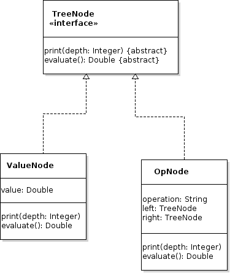

# Assignment 2 - Trees

## Identification

Your name:  `INSERT YOUR NAME HERE`

Your teammates name:  `INSERT YOUR TEAMMATES NAME HERE (if you have one)`

## Collaboration Policy
Students are encouraged to work in teams of two students for this assignment. Students can work alone, if they prefer.  Teams larger than 2 are not permitted.

## Overview
For this assignment, we will experiment with a few different sorting techniques, and will use binary trees to solve a common problem (evaluating expressions).

## Part 1
For this part of the assignment, you will create two classes (in a package called `sorting`) that have a single function `sort()` that takes an array of `double` values, and sorts that array.  Each class will inherit from the abstract class `Sorter`, given below:

```
package sorting;

public abstract class Sorter {
  private long opCount = 0L;

  public long getOpCount() {
    return this.opCount;
  }

  protected void resetOpCount() {
    this.opCount = 0L;
  }

  protected void countOp() {
    this.opCount++;
  }

  public abstract void sort(double[] list);
}
```

The `Sorter` parent class has a few methods related to counting operations.  Notably, the method `countOp()` can be used by your sorting method to count the number of some operation.  You should call this method appropriately within your `sort()` method every time your code performs an assignment.

_**Note:**  You can choose any two sorting algorithms, but it is recommended that you choose two algorithms that have different performance characteristics (e.g. merge sort and insertion sort, or quick sort and radix sort)._

What follows is driver code, provided in the `Assignment2Driver` class, that can be used to test your two algorithms.  If you name your `Sorter` sub-classes differently, you can modify those class names:

```
double[] array1 = generateRandomArray(100000);
double[] array2 = array1.clone();

// algorithm #1
Sorter iSorter = new InsertionSorter();
iSorter.sort(array1);
System.out.println("Operations: " + iSorter.getOpCount());

// algorithm #2
Sorter mSorter = new MergeSorter();
mSorter.sort(array2);
System.out.println("Operations: " + mSorter.getOpCount());
```

The `generateRandomArray()` function is given, below:

```
public static double[] generateRandomArray(int size) {
	double[] array = new double[size];

	for (int i = 0; i < array.length; i++) {
		array[i] = Math.random() * 100.0;
	}

	return array;
}
```

## Part 2
Create a report (`part2.pdf`) that compares the performance of these two algorithms.  Using modifications to the `SortingDriver` class, run tests with arrays of length `10`, `100`, `1000`, `10000`, and `100000` elements (you may need to change this, depending on the performance of the sorts that you choose).  Be sure to use the same array for both sorting algorithms, as the driver class currently does.  Put the operation count into a spreadsheet and create a line chart (one series for each algorithm).

_**Note:**  You can use any tool you want to generate this report, as long as you export the report to PDF format.  If you don't know what to use, here are a few suggestions:_
- Google Docs
- Google Sheets
- LibreOffice Calc
- LibreOffice Writer
- MS Office Excel
- MS Office Word

_**Note:**  Reports must be in PDF format.  All of the above tools can export to PDF.  Save your file with the name `part2.pdf` in the root of this repository._

## Part 3
For this part of the assignment, you will implement a binary tree for mathematical expressions.  The tree data structure class, `ExpressionTree` (in the package `expressionTree`), will have the following methods:
•	A constructor – Takes a root node of the tree
•	`evaluate()` - returns the value of the expression (double)
•	`print()` - prints a sideways representation of the tree (see sample output, below)

Nodes in the tree will be one of the following classes (all of which, you will implement):



Use the following code, which is already in the `Assignment2Driver` class to test your expression tree:

```
// 2 + (8 * 3)
ValueNode two = new ValueNode(2);
ValueNode three = new ValueNode(3);
ValueNode eight = new ValueNode(8);
OpNode eightTimes3 = new OpNode(eight, "*", three);
OpNode twoPlusEightTimesThree = new OpNode(two, "+", eightTimes3);
ExpressionTree tree = new ExpressionTree(twoPlusEightTimesThree);
System.out.println("print():");
tree.print();
System.out.println("evaluate():");
System.out.println("" + tree.evaluate());

System.out.println("");

// (13 / 4) - (2 + (8 * 3))
ValueNode thirteen = new ValueNode(13);
ValueNode four = new ValueNode(4);
OpNode thirteenOverFour = new OpNode(thirteen, "/", four);
OpNode bigExpression = new OpNode(thirteenOverFour, "+", twoPlusEightTimesThree);
ExpressionTree tree2 = new ExpressionTree(bigExpression);
System.out.println("print():");
tree2.print();
System.out.println("evaluate():");
System.out.println("" + tree2.evaluate());
```

This driver should produce the following output:

```
print():
		3.0
	*
		8.0
+
	2.0
evaluate():
26.0

print():
			3.0
		*
			8.0
	+
		2.0
+
		4.0
	/
		13.0
evaluate():
29.25
```

## Rubric
### Part 1 (6 marks total)
Value | Requirement
------|------------
1.5 | Implementation of algorithm #1
1.0 | Assignment operation counting for algorithm #1
1.5 | Implementation of algorithm #2
1.0 | Assignment operation counting for algorithm #2
0.5 | Inclusion and correctness of Javadoc-style comments
0.5 | Code style and quality (indentation, naming, commenting, best practices)

### Part 2 (2 marks total)
Value | Requirement
------|------------
1.0 | Table of operations (rows:  10, 100, 1000, 10000, 100000; columns:  Algorithm 1 (named), Algorithm 2 (named))
1.0 | Line chart

### Part 3 (7 marks total)
Value | Requirement
------|------------
1.5 | Implementation of the ExpressionTree class
1.0 | Implementation of the TreeNode interface
1.5 | Implementation of the ValueNode class
2.0 | Implementation of the OpNode class
0.5 | Inclusion and correctness of Javadoc-style comments
0.5 | Code style and quality (indentation, naming, commenting, best practices)

## Compiling and Running Your Program
To compile and run your program, use the following command:
`gradle run`

## Submission Instructions
Modify the Java classes as described in this document, and add any additional classes you decide you need to write to complete this lab assignment.  Commit and push your code to this repository.

The late assignment policy in this course is a deduction of 10% of the maximum grade for every day late, up to 3 days.  After 3 days, the assignment will not be accepted.

This repository will be marked by the TA or instructor at their convenience, but any changes made to this repository after the due date (described above) will not be considered automatically.  If you wish those changes to be marked, and the corresponding late penalty to take effect, please communicate your wishes to the instructor.

## Getting Help
If you run into difficulty, you may wish to check out some of the following resources:
- https://docs.oracle.com/javase/tutorial/tutorialLearningPaths.html - A series of tutorials for the Java programming language, focusing almost entirely on the features of Java
- https://docs.oracle.com/en/java/javase/14/ - The standard documentation for Java classes, including methods that you can use, some of which will be discussed later in this course
- http://stackoverflow.com/ - A forum for asking questions about programming. Chances are, someone else has asked the same question as you have, and some knowledgeable person has already answered it.  This might be a good time to use the ‘site:’ feature in Google!

Of course, you can always ask the TAs or the instructor for help! However, learning how to find the answers out for yourself is a skill that will pay off in the future, as solving your own problem is immediate (and satisfying)!

## Academic Integrity
Discussing strategies with your fellow students is acceptable, but once it is time to write the code you should do so on your own (or with only your group).  The instructor has learning goals planned for this course which are cumulative.  If you fail to learn some elements in this assignment, it most likely will affect your performance on higher-stakes assessments in the future.  You can also ask the TA or the instructor for help, but they won't directly solve your problems for you, but will rather point you in the right direction to find the solution yourself.
